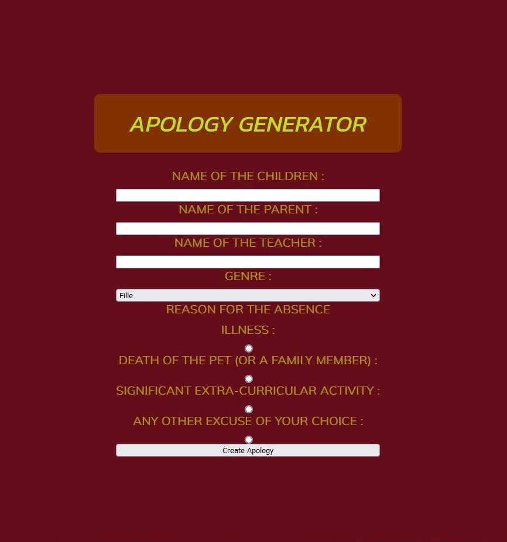

# PHP Fundamentals

Discovery and learning of the PHP language.
Installation and use of local server via XAMPP on Ubuntu and WAMP on WIndows.

## Subject matter
- Installation Xampp / Wamp
- Variables
- Conditions
- Drill
- Project : "Apology Generator"
- Array
- Loop
- Functions
- Form

## Screenshots

Screenshot from the project "Apology Generator".

